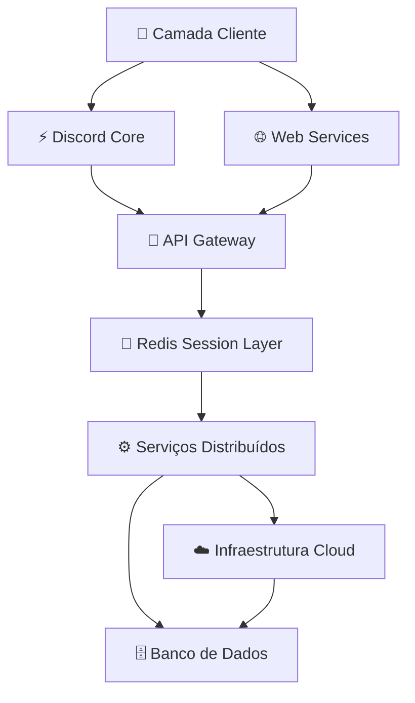

<!-- Banner principal -->

  

<!-- Animação de digitação -->

  

 

<!-- Badges sociais e de contato -->

  
  
  
  

 

<!-- Badge de visitas ao perfil -->

  

---

## 👨‍💻 Sobre Mim

  <table>
    <tr>
      <td>
        <ul>
          <li>🔭 Atualmente focado em <strong>plataformas SaaS</strong> e <strong>ecossistemas Discord</strong></li>
          <li>🧠 Especialista em <strong>Backend</strong>, <strong>Sistemas Distribuídos</strong> e <strong>Infraestrutura Cloud</strong></li>
          <li>⚙️ Construindo a <strong>NEXUS Platform</strong> e o framework <strong>OpenClaw</strong></li>
          <li>🐧 Ambiente de desenvolvimento 100% <strong>Linux</strong> com <strong>Docker</strong> & <strong>Redis</strong></li>
          <li>📡 Arquiteturas assíncronas, APIs seguras e comunicação em tempo real</li>
        </ul>
      </td>
      <td>
        
        <!-- Substitua por um GIF personalizado ou remova -->
      </td>
    </tr>
  </table>

---

## ⚙️ Stack Tecnológica

| **🔙 Backend** | **🖥️ Frontend** | **🗄️ Infraestrutura** | **🛠️ Ferramentas** |
|----------------|-----------------|------------------------|----------------------|
| Python 🐍 | TypeScript 💙 | Docker 🐳 | Git 📦 |
| Go 🩵 | JavaScript 🟨 | Linux 🐧 | VSCode 💻 |
| Rust 🦀 | TailwindCSS 🌊 | Redis 🔴 | GitHub Actions ⚡ |
| Node.js 💚 | | VPS/Cloud ☁️ | Nginx 🌐 |

### 📊 Nível de Domínio

| Tecnologia  | Proficiência                     |
|-------------|----------------------------------|
| Python      | ████████████████████ 100%        |
| Go          | ███████████████░░░░░ 75%         |
| Rust        | ████████████░░░░░░░░ 60%         |
| TypeScript  | ██████████████████░░ 90%         |
| JavaScript  | ██████████████████░░ 90%         |
| Docker      | █████████████████░░░ 85%         |
| Linux       | ███████████████████░ 95%         |
| Redis       | ████████████████░░░░ 80%         |

---

## 🚀 Projetos em Destaque

| 🤖 NEXUS PLATFORM | 🐾 OPEN CLAW |
|-------------------|--------------|
|  |  |
| Ecossistema modular para Discord com:  ✔ Automação Anti Raid/Nuke  ✔ Autenticação OAuth2  ✔ Sistema de Tickets  ✔ Infraestrutura Cloud  ✔ Arquitetura de Sessões | Framework backend moderno com:  ✔ Estrutura modular  ✔ Alto desempenho  ✔ Integrações avançadas  ✔ Arquitetura extensível  ✔ Foco em escalabilidade |
|  |  |
| [🔗 Repositório](https://github.com/LucasDesignerF/nexus) | [🔗 Repositório](https://github.com/LucasDesignerF/openclaw) |

> 💡 *Clique nos links acima para explorar os repositórios (substitua pelos seus links reais).*

---

## 🏗️ Arquitetura de Sistemas

---

## 📈 Estatísticas do GitHub

  
  

  

  

<!-- Gráfico de atividade (substitua pelo seu username) -->

  

---

## 🔐 Princípios de Engenharia

| 🎯 Foco | 📏 Padrão |
|--------|-----------|
| Performance | Código limpo e sustentável |
| Escalabilidade | Desenvolvimento modular |
| Segurança | Fluxos de autenticação robustos |
| Disponibilidade | Comunicação em tempo real |
| Resiliência | Testes automatizados e CI/CD |

---

## 🧠 Filosofia

> *"Software de qualidade transcende a funcionalidade: ele precisa ser escalável, sustentável e confiável.  
> Cada linha de código é um investimento no futuro do sistema."*

---

## 🌐 Vamos Conectar?

---

  
    
  <strong>⚡ LucasDesignerF</strong> 
  Construindo sistemas modernos, escaláveis e performáticos.

